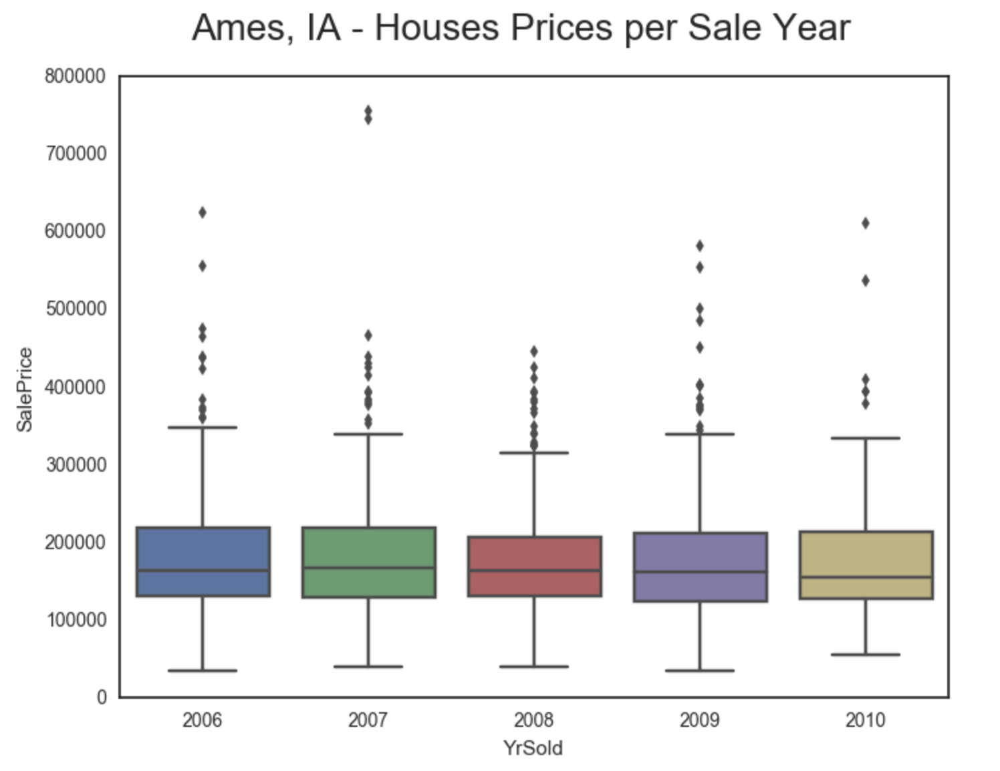
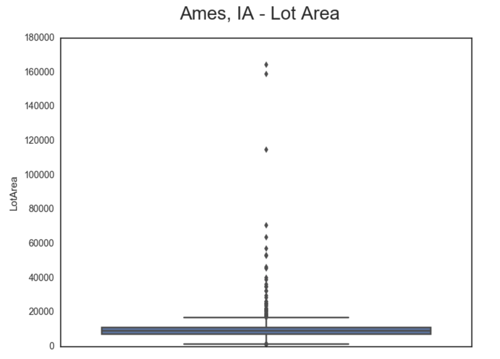
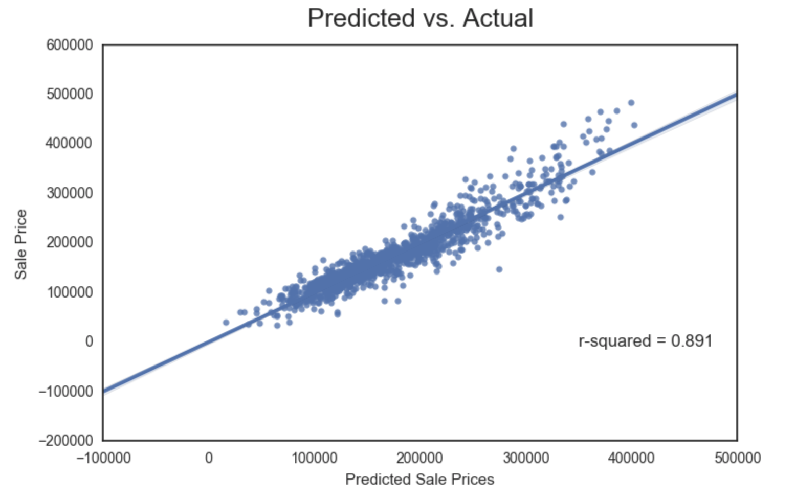

### Introduction

This is the third week's project in DSI-GA and it covers the Real Estate (RE) market in Ames, IA.
I will try to devise a model for predicting house prices and determine the high-price neighborhoods.

### The data set

The data set comes from a Kaggle competition. It covers 5 years of sales data (2006-2010) in Ames, comprises 1460 rows, each one with 81 attributes. The data set was reduced to 19 columns, of which the main ones are (before analysis):

  - Sale Price
  - Lot Area
  - Neighborhood
  - Overall Quality
  - Year Built
  - Living Area

The data set is complete, with no missing data. However, there are a number of outliers that we will have to deal with.

### Cleaning the data

With a complete data set and appropriate types, the cleaning was merely a function of choice. It was apparent, from a Seaborn pairplot, that 'Utilities' was not a useful feature (1459 'AllPub', 1 'NoSeWa'), therefore the column was discarded.

Since the data set covered the bursting of the housing bubble and the 2007-2009 recession, I expected the prices to decline throughout the period covered. I drew a boxplot of the Sale Price per year to confirm the intuition. Surprisingly, the RE market was very stable in Ames.

This plot identifies a few outliers. The neighborhood averages made it clear that prices in Ames are not uniform, with Meadow Village below $100k and Northridge at $335k. For the purpose of designing my model, I will eliminate outliers on a neighborhood basis, specifically the sales above their neighborhood average plus two standard deviations.

The 'LotArea' column also requires some cleaning with outliers. The box plot below demonstrates that the vast majority of the lots are under 20,000 sq.ft. while a few exceptions reach north of 100,000 sq.ft. This time, the elimination will be based on a town-wide average plus two standard deviations.

The 'YearRemodAdd' column was next. I made the assumption that a 1993 remodeling would not be of much value in 2010. Arbitrarily, I decided that 2000 was my cutoff year to accept the validity of a remodeling. So, the feature was converted to a dummy variable (1999 and before: 0; 2000 and after: 1).

Five more categorical variables were then converted to dummies ('Neighborhood', 'BldgType', 'HouseStyle', 'RoofStyle', 'RoofMatl').

### Modeling the data

I started with statsmodels and sklearn linear regressions. They provide the same results, but both were useful for different reasons for my next step. At this stage, the r^2 is at 0.891, which seems excellent and might be overfitting.

In order to eliminate some additional features (and reduce the overfitting), I compared the p-values from the statsmodels linear regression. One feature with high p-values and what I considered as low contributions (feature coeff * feature avg value) was eliminated: RoofStyle and RoofMaterial. The linear regression was run again and resulted in an r^2 of 0.889. The cross-validation (5 folds) resulted in an r^2 of 0.878. Below is a scatter plot of the actual sale prices vs. predicted, as per the second iteration of the model.

### Conclusion

The Real Estate market in Ames, IA was quite resilient during the bursting of the housing bubble. The neighborhoods of Northridge, Northridge Heights and Stone Brook attracted the best prices, while North Ames, College Creek and Old Town saw the most sales. 

I hope you enjoyed the read. You can consult my Jupyter Notebook 

