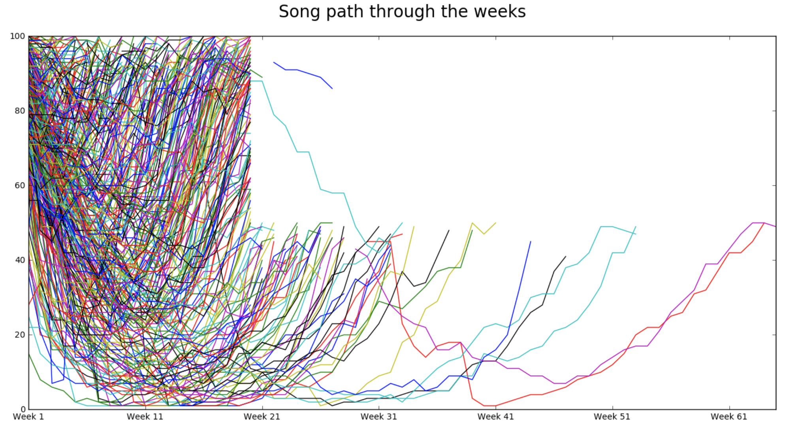
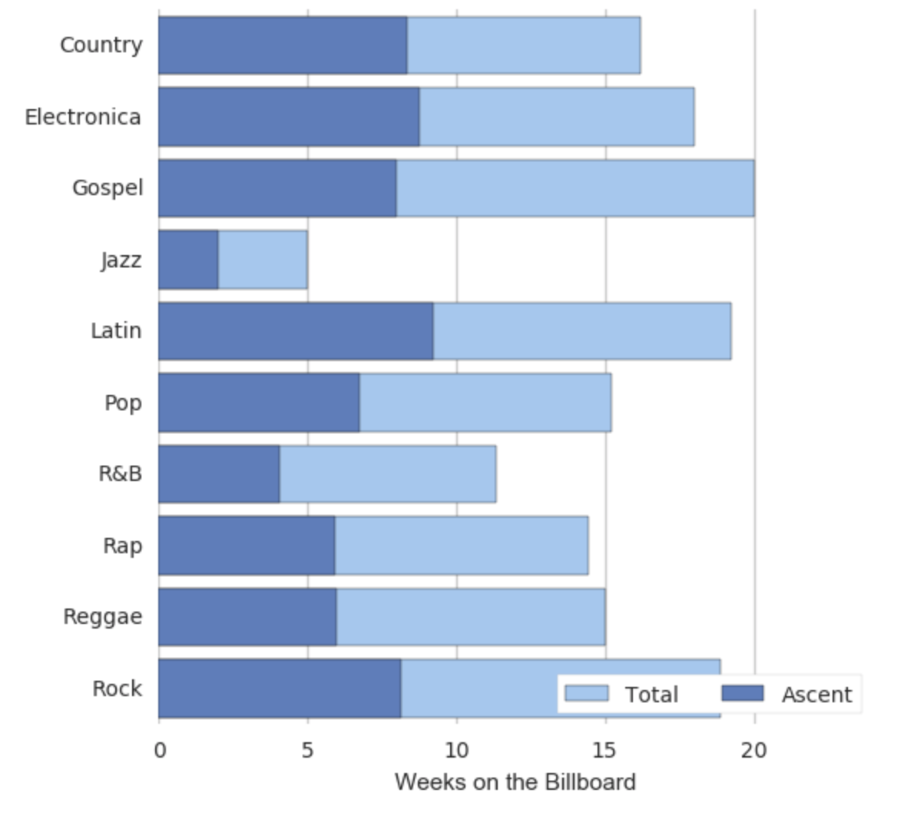

### Introduction

The second project for the DSI NYC was about a dataset from Billboard Top 100 for the year 2000. My hypothesis is that the music genres mostly geared towards a younger audience might have higher turnover and shorter song duration (after all, A.D.D. has to start somewhere...)

### The data set

The data set (317 rows. 83 columns) comprises the following columns:

  - year: all values here are 2000, the year the song peaked (see below).
  - artist: name of the artist
  - time: duration of the song (as a string)
  - genre: in 12 categories, two of which seem redundant (is there a difference between 'Rock' and 'Rock'n'roll'? Between 'R & B' and 'R&B'?)
  - date.entered: the date at which the song first entered Billboard Top 100 (as a string.)
  - date.peaked: the date at which the song reached its higher ranking (as a string.)
  - x1st.week through x76th.week: 76 columns, where the values are each song's ranking for that week (1st week means the week the song entered the Billboard.)

The data set seems complete to the extent that missing values (represented by an asterisk in the weeks 2 through 76) are normal, since filling those columns depends on the length of the run each song had in the Billboard.

### Preparing the data

This week, we used Pandas to treat the data. 

First, I checked data types and decided to clean the data in 'time' column, by converting it to the number of seconds (as an integer.)

I decided to check the content of the last 20 columns to see how relevant they were. The last 11 were empty, therefore I dropped them. Next step was to recast the remaining weekly columns as integers. The last check there was on the music genres. Two of them ("Rock'n'roll" and "R & B") seemed redundant and their data was moved into "Rock" and "R&B".

### Inspecting the data

As I was ready to treat the data, I did a last check on the first 25 rows: that's where I realized that my hypothesis, right or wrong, would be hard to confirm with this data set:

  - in row 17, Faith Hill is labeled as "Rap". I listened to the song in order to check the genre, and it was much closer to "Syrup" than "Rap."
  - N'Sync, Mariah Carey and Christina Aguilera (among others) are labeled as "Rock."

I ran a check on the genres. There were 9 pop songs (out of 317!) to appear in the Top 100 in 2000. This seems extremely low, considering what is usually broadcast on the radio. I then checked a plot of the track path through the weeks.

There was clear evidence of 'chart manipulation'.

### Conclusion

From Wikipedia:

> Billboard, in an effort to allow the chart to remain as current as possible and to give proper representation to new and developing artists and tracks, has (since 1991) removed titles that have reached certain criteria regarding its current rank and number of weeks on the chart. Recurrent criteria have been modified several times and currently (as of 2015), a song is permanently moved to "recurrent status" if it has spent 20 weeks on the Hot 100 and fallen below position number 50. Additionally, descending songs are removed from the chart if ranking below number 25 after 52 weeks.

It became clear for the chart above and the Wikipedia entry that the Billboard Top 100, rather than an impartial collection of sales data (since updated to streaming and other methods of 'consuming' music), is a marketing tool for the music industry. A high turnover of songs allows for marketing more songs as 'Top 100 material'. 

This data set seems to illustrate the 'garbage in, garbage out' expression pretty well. It is still possible to draw nice plots:

What are they worth when the underlying data is dirty? 

I'm assuming that was part of the teachings we can take from this week's project.

