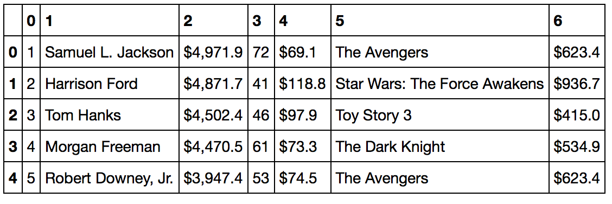

### Introduction

This week, we were tasked with developing a model for predicting IMDB ratings. We were to start from a scrape of IMDB movies to build a dataframe containing the requisite data to run a classification model.

### The scrape
 
As seen in past efforts, I seem to have developed an interest for web scraping. I started by scraping IMDB.com for movie ID's for 10,000 movies from the US. From there, I went on to OMDB API to obtain movie information beyond the ID. OMDB's API is very easy to use once you have a movie ID and provides a dictionary with the movie's main info:
  
  - four actors names
  - awards
  - director
  - plot
  - rated
  - response
  - language
  - title
  - country
  - writer
  - metascore
  - imdbRati
  - release date
  - year
  - genre
  - runtime
  - type
  - poster
  - imdbVotes
  - imdbID

My next step was to scrape boxofficemojo.com for actors and directors 'box office value'. Actors (837 of them) and directors (868 of them) are ranked by the combined box office gross of the movies they appeared in.

### The data

In the 10,000 items scraped, there was a large number of TV series. For homogeneity purposes, I got rid of them.

I built dictionaries for the actors and directors, where the key would be the name and the value would be the rank in an inverted ranking: actor ranked nr. 1 (Samuel L. Jackson) gets a 'value' of 838, actor nr.2 gets 837, and so on. Actors not on the boxofficemojo ranking get a value of 1, as well. Same for directors from 866 to 1, with one manual input: Francis Ford Coppola, for reasons unknown, doesn't appear on boxofficemojo ranking of directors... I unilaterally gave him a value of 850.

I transformed other columns, such as:
  - the Awards column, where I extracted the number of Oscars each movie won;
  - the Genre column: multiple genres are attributed to each movie; I only kept the first one; I then gave each genre a value, based on that genre's presence in the Top 250 movies;
  - the Runtime column was transformed to minutes;
  - the Release Date column was transformed to datetime objects;
  - the Rating column was dummified.

All told, I had about 8000 movies to do my modeling on. As per the plot below, there is a bias towards more recent movies.

### The modeling

My target was to identify if a movie was highly rated or lowly rated, based on the median IMDB rating of 6.5 for my data set. 

At first, I ran a cross validation on a Decision Tree Classifier and a Bagging Classifier. My features were the Actors, Directors and Genre ratings I engineered, coupled with Runtime, Year and Movie Ratings dummified. Those models yielded results of 65% and 69% respectively, with the Decision tree Classifier run again on a train-test split of my data, for a result on the test sample at 66%. The main features were 'Year' and 'Runtime'. As seen below, there is a trend in the average IMDB rating per year, which can easily be understood: if I watch a movie from 1973, it tends to be a good one, while we tend to watch all sorts of recent movies.

In quest of better results,  I got rid of the Genre ratings I created and the dummified film ratings in favor of dummified genres. This improved the model very slightly to 68% (DTClassifier) and 72% (Bagger).

I assumed that because I had buit my features on box office numbers, maybe I had built a model to identify box office success, rather than movie quality. I went back to scraping and got the movie grosses and ran a model to identify commercial success, instead of quality ratings. My model performed even worse, and that's when it hit me: I only had specific values for 837 actors and 867 directors, when the actors count was over 12,000. I didn't have enough separation on the actors to identify them properly in the model.

I went back to the drawing board and made new dictionaries of actors and directors, where a person's value would be in the average IMDB rating of the movies they performed in. This model performed much better, with the Decision Tree Classifier success rate at 88%, based on the best parameters of a grid search. The director rating overwhelmed all other features in terms of importance.

### Conclusion

I think I initially over-engineered my features and tried to find a different angle, when I got the best results with a more simple approach. 

Next, I would like to expand this analysis to movies from different countries. A larger scrape would also help, as any model should probably get better with a larger sample size.