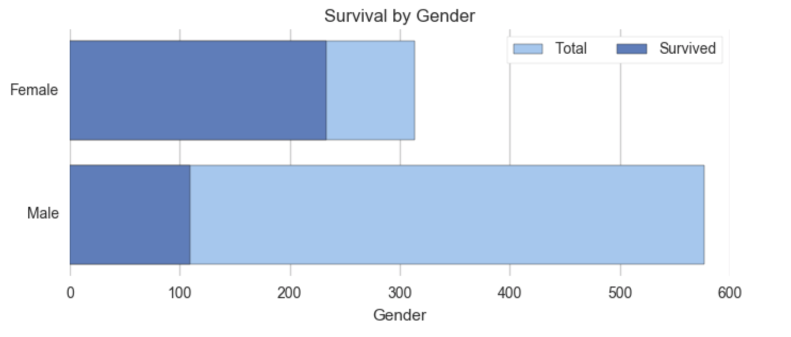
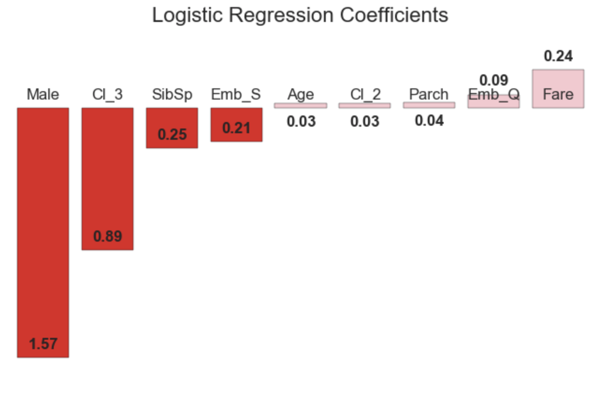
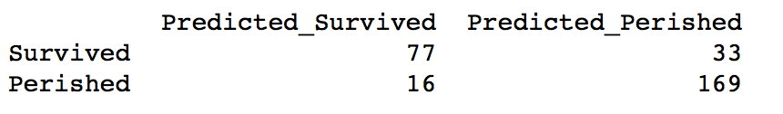

### Introduction

The fifth project for DSI-GA covers the disaster of the Titanic, as a proxy for disasters survival prediction.

We have been tasked with developing models to help predict the chances of survival of victims of natural disasters. While our firm doesn't have a data set to share with clients (for confidentiality reasons), we are able to demonstrate our capabilities on the data set related to the Titanic. 

### The data set

There were 891 passengers on the Titanic, 342 of whom survived. The plot below illustrates the difference between the chances of survival, according to gender.

The data was pretty clean, except for Age, with 177 data points missing. The missing values will be filled with the column average. Cabin numbers were missing in even larger numbers, so we will drop that feature. 

Numeric values will be normalized and categorical values will be dummified.

### Regressions

The first regression was a logistic regression. The accuracy score was 81%, with the main lagger the recall on survivors (predicted perished, but survived.)

Next was KNN. The best score was on 3 k_neighbors and uniform weights. The accuracy score was 78%, with a more uniform classification report.

Last was the decision tree classifier, which performed the best with an accuracy score of 83%.

### Conclusion

While the different models we ran were able to improve on the baseline of 62% accuracy, only two were able to climb above 80% accuracy. The most damaging stat was the survivors part of the recall (those predicted perished but who survived). While it is a better solution to the alternative (those predicted surviving, but perished), it doesn't help in managing future disasters.

Efforts will be made towards improving those numbers, maybe through the adoption of different models (Random Forest?)
Another possible improvement would be to fill in the Age column through publicly available sources. This might help improve the contribution of the Age column to the overall model accuracy.